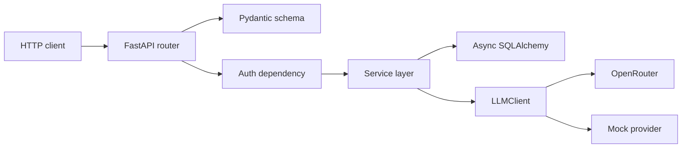

# Architecture

## Runtime Components

1. `app/routers/*` exposes HTTP contracts only:
   - parse request bodies
   - apply auth dependencies
   - delegate to services
2. `app/services/*` owns business logic:
   - registration/login
   - conversation ownership rules
   - SSE streaming orchestration
3. `app/models.py` + `app/database.py` define relational persistence:
   - `User` -> `Conversation` -> `Message`
   - SQLAlchemy async session lifecycle
4. `app/services/llm.py` isolates external AI providers behind `LLMClient`:
   - `MockClient` for deterministic local/CI behavior
   - `OpenRouterClient` for real provider calls when key is configured

## Chat Request Lifecycle

1. `POST /chat` authenticates via bearer token.
2. User message is validated and persisted immediately.
3. Provider stream begins without keeping a DB transaction open.
4. SSE events are emitted:
   - `event: token` for each content delta
   - `event: done` on success
   - `event: error` on provider failure
5. Assistant message is persisted only after successful stream completion.

This preserves ownership boundaries and avoids long-lived DB transactions across
network I/O.

## Storage Choice

PostgreSQL is the runtime database because the core domain is relational and
constraints matter (ownership, FK integrity, unique email). SQLite is used in
tests to keep runs fast and deterministic.

## Logging and Security Boundaries

- Request IDs are attached in middleware and propagated in JSON logs.
- Prompts, model outputs, passwords, tokens, and API keys are never logged.
- Cross-user conversation access returns 404, not 403, to avoid leaking
  resource existence.

See `docs/faq.md` for notes on `alembic/script.py.mako`, `__pycache__`, and
FastAPI validation status codes.
