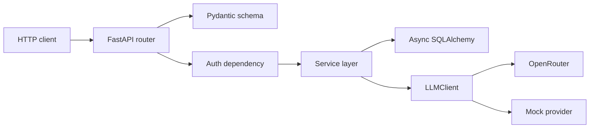

# Architecture

Routers only parse and shape HTTP. Services own the business logic and state
changes. The database layer is async SQLAlchemy with PostgreSQL in runtime and
SQLite in tests.

The single provider boundary is `LLMClient`. The concrete implementations are
`MockClient` and `OpenRouterClient`.

The logging layer is stdlib only. Each request gets a request id, attached to
the response header and bound into JSON logs via a context variable.

PostgreSQL is the right storage choice for this assignment because the domain is
strictly relational and the schema constraints are part of the solution.

